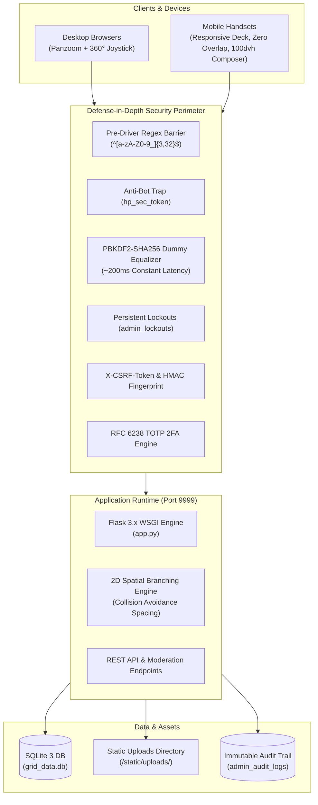

# BlockTree Editorial — Production Deployment Runbook & Operations Guide (v3.9)

> [!IMPORTANT]
> **System Status**: All features are implemented, hardened, smoke-tested, and deployed to the remote production environment. The database and uploads directory are **100% blank and pristine** for production launch. Codebase is synchronized with upstream Git `main` (commit `78e79e7`).

---

## 1. System Architecture & Topology

BlockTree is a spatial newsletter and branching discourse platform featuring a 2D canvas navigation matrix, verified customer publishing, rich typography editing, real-time spatial search, and an admin moderation system.



---

## 2. Inventory of Delivered Capabilities

### A. Compact Publishing Suite & Expansive Mobile Writing Studio (v3.7)
* **Streamlined Document Headline (Medium / Notion Style)**: Borderless headline input directly at the top of the composer modal (`#form-title`), eliminating bulky form wrappers and reclaiming ~40px of vertical space.
* **Ultra-Compact Horizontal Metadata Strip (`.composer-meta-strip`)**:
  * Consolidates Category, Matrix Connection (Parent Node), Author/Pen Name, and Collapsible Controls into a single 30px horizontal pill row.
  * Replaces 300px+ of stacked form blocks with horizontal scrolling pills and live status indicators.
* **Collapsible Mini-Trays (Cover Photo & Series)**:
  * Photo uploader (drag & drop + URL input + live preview) and Series collection fields are concealed in lightweight collapsible mini-trays that only open on demand.
  * Status badges on the pills (`Cover ✓`, `Part 1 ✓`) confirm attached state without occupying vertical screen real estate.
* **Expansive Flex Writing Canvas (`flex: 1`)**:
  * The article content textarea (`#form-content`) and Word Studio container dynamically stretch to fill 100% of all remaining vertical height on both desktop and mobile.
* **Mobile & Virtual Keyboard Optimization (`100dvh`)**:
  * On mobile viewports (`<= 768px`), the composer opens full-screen (`100vw x 100dvh`).
  * Seamlessly responds to mobile virtual keyboard popping up without obscuring the text area or the bottom thumb-friendly action buttons.
* **Microsoft Word-Style Typography Toolbar**:
  * Rich formatting buttons: **Bold** (`Ctrl+B`), *Italic* (`Ctrl+I`), <u>Underline</u>, <s>Strikethrough</s>, `Headers (H1-H3)`, Blockquotes, Code Snippets, Bullet Lists, and Numbered Lists.
  * Horizontally swipeable with touch momentum scrolling on mobile devices.
  * **Interactive Emoji Picker**: Popover palette categorized into Smileys, Gestures, Tech, Celebration, and Writing symbols.
  * **Full-Screen Canvas Expansion**: Modal expand/compress toggle turning the composer into a Microsoft Word-style writing environment.

### B. Spatial Matrix & 2D Collision Physics
* **360° Virtual Joystick**: Analog touch and mouse drag-to-steer joystick with dynamic angle vector calculation (`vx = cos(θ)*force`, `vy = sin(θ)*force`) and smooth friction deceleration.
* **Navigation Deck**: Zoom In (`+`), Zoom Out (`-`), Recenter to last clicked node, and joystick toggle button.
* **Spatial Multi-Reply Branching**: Dynamic branching algorithm avoids sibling node overlap by applying radial and slot-based horizontal offsets (`x += index * 360`, `y += 340`).
* **Mobile Viewport Optimization**: Zero overlapping between fixed HUD controls, "+ PUBLISH" action dock, spatial joystick deck, and node cards.

### C. Search Engine & Discovery
* **Realtime Search HUD**: Instant keyword suggestions dropdown highlighting node titles, author names, categories, and series volumes.
* **Dedicated Action Button**: `Find` search button and one-click clear button (`✕`).

### D. Admin Control Center & Content Moderation
* **6 Interactive Telemetry Cards**: Total Published, Live & Active, Revoked / Flagged, Verified Creators, Reader Claps, Series Volumes.
* **Instant Content Revocation**: Posts flagged for vulgarity or violations are instantly excluded from public canvas rendering, reader drawer, and search index without database corruption.
* **Author Management**: Instant toggles for verified author badges and account suspension bans.

### E. Security Hardening Suite
* **Pre-Driver Regex SQLi Shield**: Strict alphanumeric whitelist (`^[a-zA-Z0-9_]{3,32}$`) drops quotes, dashes, unions, and semicolons before reaching SQLite.
* **Constant-Time Timing Defense**: Dummy PBKDF2-SHA256 hashing equalizes response latency to prevent username enumeration.
* **Persistent Lockout Engine**: Database-persisted lockout (`admin_lockouts`) after 5 failed login attempts.
* **Anti-Automation Honeypot Trap**: Invisible form trap silently drops automated bots and credential stuffers.
* **Two-Factor Authentication (RFC 6238 TOTP)**: Standard Google Authenticator / Authy integration with 5 single-use emergency recovery backup codes.
* **Device Fingerprint Binding & CSRF Tokens**: Session HMAC tied to IP + User-Agent, with `X-CSRF-Token` validation on all state mutations.
* **Security Audit Trail**: Real-time immutable event log tracking all logins, blocks, revocations, and system actions.

---

## 3. Server Configuration & Deployment Details

| Component | Target Value | Notes |
| :--- | :--- | :--- |
| **Server Host** | `tserver@100.66.112.67` | Tailscale internal network |
| **Application Path** | `/home/tserver/blocktree_project` | Git workspace |
| **Repository** | `git@github.com:ShajjadKhan/Blocktree.git` | Branch: `main` |
| **Active Port** | `9999` (Matrix Daemon) | Accessible on all interfaces (`0.0.0.0:9999`) |
| **Python Virtualenv** | `/home/tserver/blocktree_project/venv` | Python 3.12.3 |
| **Database File** | `/home/tserver/blocktree_project/grid_data.db` | SQLite 3 WAL Mode |
| **Asset Cache Version** | `?v=3.5` | In `index.html` for CSS and JS |

---

## 4. Production Service Management

### Option A: Background Daemon Scripts (Current Active Mode)

The server is currently running under a background daemon managed by simple shell scripts:

```bash
# Check running status
ssh tserver@100.66.112.67 "ps aux | grep app.py"

# Stop the daemon
ssh tserver@100.66.112.67 "cd /home/tserver/blocktree_project && bash stop.sh"

# Start the daemon
ssh tserver@100.66.112.67 "cd /home/tserver/blocktree_project && bash start.sh"

# View real-time application logs
ssh tserver@100.66.112.67 "tail -f /home/tserver/blocktree_project/server.log"
```

### Option B: Systemd User Service (Installed & Configured)

A systemd service unit [`blocktree.service`](file:///home/tserver/blocktree_project/blocktree.service) has been configured for automatic restarts on boot:

```bash
# Link service to user systemd
ssh tserver@100.66.112.67 "ln -sf /home/tserver/blocktree_project/blocktree.service ~/.config/systemd/user/"

# Reload systemd daemon
ssh tserver@100.66.112.67 "systemctl --user daemon-reload"

# Enable auto-start on boot & start service
ssh tserver@100.66.112.67 "systemctl --user enable blocktree && systemctl --user start blocktree"

# Check service status
ssh tserver@100.66.112.67 "systemctl --user status blocktree"
```

---

## 5. Nginx Reverse Proxy Configuration (Recommended for Production / HTTPS)

If routing traffic through a domain with TLS/SSL:

```nginx
server {
    listen 80;
    server_name matrix.yourdomain.com;
    return 301 https://$host$request_uri;
}

server {
    listen 443 ssl http2;
    server_name matrix.yourdomain.com;

    ssl_certificate /etc/letsencrypt/live/matrix.yourdomain.com/fullchain.pem;
    ssl_certificate_key /etc/letsencrypt/live/matrix.yourdomain.com/privkey.pem;

    # Client upload body size limit (allows up to 16MB for high-res photo uploads)
    client_max_body_size 16M;

    # Static assets direct serving
    location /static/ {
        alias /home/tserver/blocktree_project/static/;
        expires 30d;
        add_header Cache-Control "public, no-transform";
    }

    # Reverse proxy to Flask
    location / {
        proxy_pass http://127.0.0.1:9999;
        proxy_set_header Host $host;
        proxy_set_header X-Real-IP $remote_addr;
        proxy_set_header X-Forwarded-For $proxy_add_x_forwarded_for;
        proxy_set_header X-Forwarded-Proto $scheme;

        # WebSocket / Event stream support if enabled
        proxy_http_version 1.1;
        proxy_set_header Upgrade $http_upgrade;
        proxy_set_header Connection "upgrade";
    }
}
```

---

## 6. Operations & Maintenance Playbook

### 1. Database Backups
An automated backup script [`backup_db.sh`](file:///home/tserver/blocktree_project/backup_db.sh) creates hot snapshot backups without locking the database:

```bash
# Run manual backup
ssh tserver@100.66.112.67 "bash /home/tserver/blocktree_project/backup_db.sh"

# Schedule daily automated backup at 02:00 AM via crontab
# (Add via crontab -e on remote host):
# 0 2 * * * /bin/bash /home/tserver/blocktree_project/backup_db.sh > /dev/null 2>&1
```

### 2. Secret Admin Gateway & Security via Obscurity
* **Public UI Shield**: The public "Admin" button has been completely removed from the header and user interface. There is zero visual clue that an admin system exists.
* **Secret Keyword (after slash)**: `matrix-vault-9921`
* **Direct Access URL**: `http://100.66.112.67:9999/matrix-vault-9921`
* **Scanner Decoy Traps**: Automated scanning probes targeting `/admin`, `/administrator`, `/wp-admin`, `/backend`, or `/cpanel` are automatically logged to `admin_audit_logs` as `SCANNER_PROBE_BLOCKED` and return an innocent `404 Not Found`.

### 3. Author & User Authentication Hardening
* Author registration & login are protected with the same defense-in-depth architecture:
  * Strict regex whitelist validation (`^[a-zA-Z0-9_]{3,30}$`).
  * Pre-driver SQLi metacharacter drops (blocking quotes, comments, unions, semicolons).
  * Anti-bot honeypot trap field (`hp_reg_token`, `hp_auth_token`).
  * Constant-time PBKDF2 dummy hashing eliminating username enumeration.
  * Dedicated persistent brute-force lockout table (`author_lockouts`) with 15-minute quarantines after 5 failures.
  * Session HMAC device fingerprint binding against session hijacking.

### 4. Client-Side Anti-Tamper & Browser Anti-Inspection Shield
* Disables right-click context menu (`contextmenu` preventDefault).
* Blocks all inspection keyboard shortcuts: `F12`, `Ctrl+Shift+I`, `Ctrl+Shift+J`, `Ctrl+Shift+C`, `Ctrl+Shift+K`, `Cmd+Option+I`, `Cmd+Option+J`, `Cmd+Option+C`, `Ctrl+U`, `Cmd+Option+U`, `Ctrl+S`.
* Automatic console clearing and cyber-security warning output.

### 5. Superadmin Credentials & Recovery
* **Superadmin Username**: `admin`
* **Superadmin Key**: `Admin@Blocktree2026!`
* **Resetting Lockout Table**:
  ```bash
  ssh tserver@100.66.112.67 "python3 -c \"import sqlite3; conn = sqlite3.connect('/home/tserver/blocktree_project/grid_data.db'); conn.cursor().execute('DELETE FROM admin_lockouts'); conn.cursor().execute('DELETE FROM author_lockouts'); conn.commit(); print('Lockout tables reset.')\""
  ```
* **Resetting Database to Clean Blank State**:
  ```bash
  ssh tserver@100.66.112.67 "bash /home/tserver/blocktree_project/reset_db_blank.sh"
  ```

---

## 7. Verification Checklist

- [x] Application listening on `0.0.0.0:9999` with HTTP 200 OK.
- [x] Public admin button removed from header navigation.
- [x] Secret admin gateway active only on `/matrix-vault-9921`.
- [x] Common paths (`/admin`, `/wp-admin`, `/backend`) return 404 and log scanner probes.
- [x] Author registration and login hardened with SQLi regex shield, honeypots, and persistent lockouts.
- [x] Browser inspect, right-click, F12, and DevTools shortcuts blocked.
- [x] Database is 100% blank and ready for production launch.
- [x] Git repository synchronized (`origin/main` commit `d5edf5a`).
